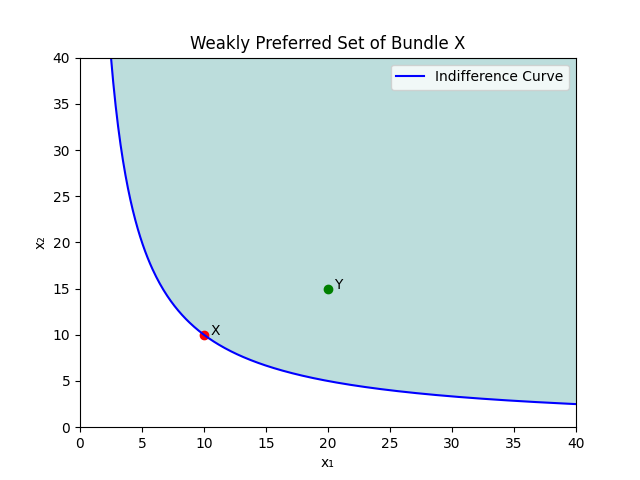
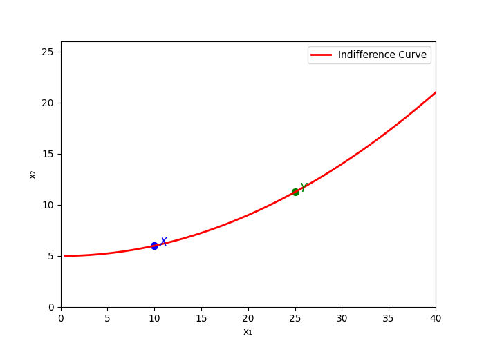
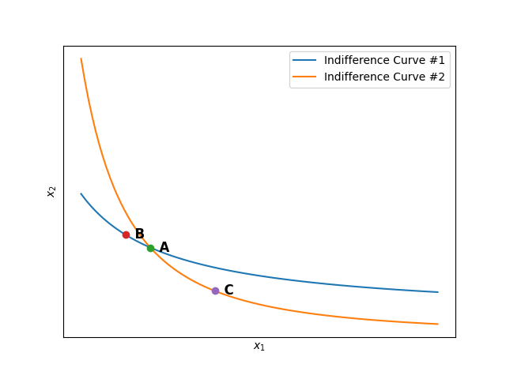

# Indifference Curves

## Indifference Set

Consider a randomly picked bundle $X$ for a consumer. Based on this bundle $X$, we can enlist all of the bundles such that the consumer is **_indifferent_** between the bundles and $X$.

This set is commonly called **_indifference set_**.

More formally, such a set can be mathematically defined as:

    Indifference Set = $\{ Z | Z \sim X for the consumer \}$

- Indifference sets are thus, set of those bundles for which the consumer is essentially indifferent if provided a choice between them.

- This definition allows us to derive some important conclusions regarding the consumer preferences.

- There are hence, infinitely many indifference sets for each different level of indifference.

While the set is itself a great tool for analysis, a  graphical representation provides more insights into the consumer's behavior. Such a depictions is described below.

## Indifference Curve - Definition

_When all the points of an indifference set are plotted graphically, we get a curve where all the sets on the curve are indifferent to each other. Such a graphical representation is called an **Indifference Curve**._

To better analyze the indifference curves, we will make a simplifying assumption that a consumer has a bundle with only two goods i.e. $X = (x_1, x_2)$.

(While this assumption seems pretty unrealistic, we can imagine this as fixing one good ($x_1$) and letting all the other goods be condensed into $x_2$. This is one way to interpret this.)

The below figures is an example of the indifference curves for a consumer:

This figure shows three indifference curves and three bundles on these curves.

Since we know that the preferences are monotonic, we see that the following holds:

    $X_3 \succ X_2 \succ X_1$

Indifference curves are extremely useful and a visual way of representing the preferences of the consumers.

## Weakly Preferred Set - Definition

For a bundle $X$, we can define the **weakly preferred set of $X$** as the **set of all the bundles which are weakly preferred to $X$ by the consumer**.

Thus, the set is mathematically defined as:

    Weakly Preferred Set = $\{ Z | Z \succeq X for the consumer \}$

Graphically, we can define the _weakly preferred set of a bundle as the region that is above the indifference curve on which the bundle lies_.

This is illustrated as follows for a two goods scenario:

The proof of this will become apparent once we discuss some interesting properties regarding the indifference curves.

## Properties of Indifference Curves

The indifference curves possess some interesting properties, and some of these are as follows:

1. **Slope of Indifference Curve**: The indifference curves are all downward sloping.

**Proof:** Suppose that, on the contrary, that the indifference curves are upward sloping as shown in the figure:

Now, consider any two bundles $X = (x_1, x_2)$ and $Y = (y_1, y_2)$ on the indifference curve.

Since the indifference curve is upward sloping, we see that $x_1 < y_1$ and $x_2 < y_2$.

Thus, we see that the bundle $Y$ is monotonically above bundle $X$.

However, this contradicts the montonicity property of the preference, which states that $Y \succ X$ but we have $X \sim Y$ since they are on the same indifference curve.

Thus, we see that the indifference curves are always downward sloping. ■

2. **No Intersection Property**: No two indifference curves can intersect each other.

**Proof:** Suppose that, on the contrary, that there are two indifference curves that intersect each other, as shown in the figure below:

We have taken curves 1 and 2, and three points $A,B,C$ on the curves, where $A$ is the point of the intersection and $B,C$ are some other points on their respective curves.

Now, the argument begins as follows: 

Since $A,B$ are on the same indifference curve, we have $A \sim B$.

Similarly, $A,C$ are on the same indifference curve, so we have $A \sim C$.

By using the law of transitivity on the two similarity, we see that $B \sim C$. 

This means that $B$ and $C$ should lie on the same indifference curve, but they lie on different indifference curve. This is a contradiction!

Thus, no two indifference curves can intersect each other. ■

3. **Convexity**: The indifference curves are always convex.

**Proof:** It directly follows from property 1 that the indifference curves are always downward sloping.

Since they are always downward sloping, their slope are always decreasing as the quantity of good 1 increases.

Thus, we see that the derivative of the indifference curves are monotonic, which shows that the curves are convex in nature.■

## Next?

Now that we know the properties of indifference curves, we have seen how the consumer's preference can be easily be visualized by using a graph.

(Note: Most of the graphs that were laid down in this was made using `Cobb-Douglas utility function`, which will be a topic in the next page).

Armed with these ideas, we will now explore the ideas of `utility` and how they relate to the present discussion.
