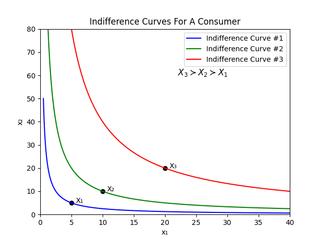

# Indifference Curves

## Indifference Set

Consider a randomly picked bundle $X$ for a consumer. Based on this bundle $X$, we can enlist all of the bundles such that the consumer is **_indifferent_** between the bundles and $X$.

This set is commonly called **_indifference set_**.

More formally, such a set can be mathematically defined as:

    Indifference Set = ${Z | Z \sim X for the consumer}$

- Indifference sets are thus, set of those bundles for which the consumer is essentially indifferent if provided a choice between them.

- This definition allows us to derive some important conclusions regarding the consumer preferences.

- There are hence, infinitely many indifference sets for each different level of indifference.

While the set is itself a great tool for analysis, a  graphical representation provides more insights into the consumer's behavior. Such a depictions is described below.

## Indifference Curve - Definition

_When all the points of an indifference set are plotted graphically, we get a curve where all the sets on the curve are indifferent to each other. Such a graphical representation is called an **Indifference Curve**._

To better analyze the indifference curves, we will make a simplifying assumption that a consumer has a bundle with only two goods i.e. $X = (x_1, x_2)$.

(While this assumption seems pretty unrealistic, we can imagine this as fixing one good ($x_1$) and letting all the other goods be condensed into $x_2$. This is one way to interpret this.)

The below figures is an example of the indifference curves for a consumer:

This figure shows three indifference curves and three bundles on these curves.

Since we know that the preferences are monotonic, we see that the following holds:

    $X_3 \succ X_2 \succ X_1$

Indifference curves are extremely useful and a visual way of representing the preferences of the consumers.
