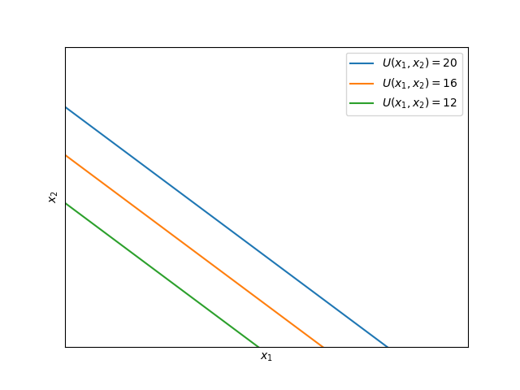
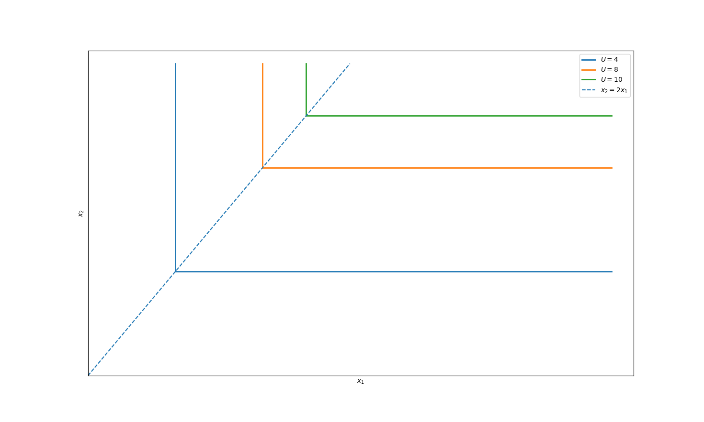
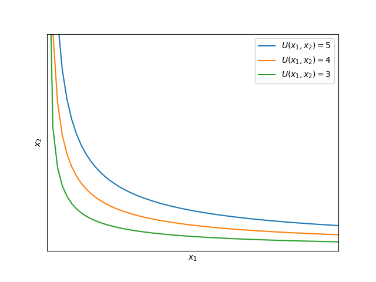

# Utility

Before the concept of consumer preference was modelled by the economists, philosophers and early time economists often talked about utility of a person.

In fact, one of the most renowed economists, `John Stuart Mill`'s father, `James Mill` was a prominent philosopher who advocated for maximum utility of an individual as an ethical goal.

While the concept seems more of philosophy, economists incorporated this idea into a mathematical form and economics and this led to the formation of the modern consumer theory. 

Before we delve more into it, let's formally define what a utility is.

## Utility - Definition

In common (and philosophical) terms, _utility is simply defined as a measure of satisfaction that a person gets after getting something or performing a certain action._

While this seems kinda superficial, this definition was moulded by J.S. Mill into a more mathematical form:

Let $S(X)$ denotes a set of all the consumption bundles that a consumer can have. 

Then, **the utility $U: S(X) \rightarrow R$ is defined as a function that maps the consumer bundles to a real number, and which satisifies the following property:**

    $X \succeq Y \iff U(X) \geq U(Y)$

Thus, instead of just having a randomly defined notion, we can have a mathematical way of organizing consumer preferences now.

- While we defined utility as a function, essentially returning a real number, in practice, _the exact value of the utility function is immaterial,_ meaning that the essence of the utility function is **ordinal** and not cardinal.

In fact, we have the following theorem on utility:

**Theorem**: If $U$ is a utility function, then for any increasing function $f: R \rightarrow R$, the function $f \circ U$ is also a utility function.

**Proof:** We note that the following chain holds:

$X \succeq Y$

$\iff U(X) \geq U(Y)$

$\iff f(U(X)) \geq f(U(Y))$

Lines 1 and 2 follow from definition, while line 3 follows from increasing property of the function $f$. 

Thus, from the definition, we see that $f \circ U$ is also a utility function over the same preferences.

- Thus, we can talk about utility being higher or lower instead of talking like, "Hey, this provides 5 times more utility!".

- We can also see that from the definition that **the indifference curves are curves where the utility remains constant.** This is an important observation that eases the concept of the indifference curved very well.

## Utility Forms

Utility functions can take many forms depending on the preferences of the individuals.

These analytical forms helps the economists to understand how utilities are affected by consumptions.

Some of these are as follows:

### 1. Perfect Substitutes

Consider a two good market such that they are the perfect substitutes of each other.

Thus, it doesn't really matter if the consumer get $m$ of good 1 or good 2.

Thus, what does the consumer really care about?

_The overall quantity of goods he has!_ Thus, the utility function for perfect substitutes can be written as follows:

$U(x_1, x_2) = x_1 + x_2$

For $n$ such perfect substitutes, the utility function can be written as:

$U(x_1, x_2, ..., x_n) = \sum_{i = 1}^{n} x_i$

In a two goods scenario, we hence see that the indifference curves must be linear, parallel to each other. This is depicted in the figure below:

While goods might not be "perfectly" substitute, yet there are quite a good approximation to this. For instance, if you went to buy apples, it doesn't matter what apples you have if you are hungry enough for apples to be blinded!

### 2. Perfect Complements

Quite contrary to the concept of perfect substitutes, where consumer do not care which one he gets, in the case of perfect complements, the consumer wants **both** of these goods for their well being.

Thus, these goods are complementary to each other. A typically good example could be a left shoe and a right shoe, or a car and the four tyres.

How will we model this?

Let's assume that a consumer needs $m$ quantity of good 2 to satisfy their needs for a single quantity of good 1.

Thus, if the consumer has $x_1$ quantity of good 1 and $x_2$ quantity of good 2, he/she will be able to use $x_1$ or $\frac{x_2}{m}$, whichever is less.

Thus, we can write the utility as:

$U(x_1, x_2) = \min(x_1, \frac{x_2}{m})$

Thus, provided this utility, we can easily draw the indifference curves. Such curves are shown below for $m = 2$:

The curves corresponds to vertical or horizontal straight lines until we have a "kink" at a point where we have $x_2 = 2x_1$.

This is crucial because it tells us that having one resource in excess, might not always help the consumer unless he gets the other resource in proportion.

This is especially true in case of raw materials needed to prepare a, say cake. No matter how much baking soda you have, once cocoa powder is finished, you cannot make more cakes by any chance!

### 3. Cobb-Douglas Utility

The examples we saw above are quite extreme; market goods are neither perfectly susbtitutes nor perfectly complements, but rather something in between.

The interdepence is pretty complicated and going into details is a bit cumbersome for this study.

However, we are more interested in a real-life approximation which was studied by Charles Cobb and Paul Douglas. While this was a prediction for the producer theory, we can apply a similar procedure on the consumer theory.

This approximation is called `Cobb-Douglas utility function` and is given in the following form:

$U(x_1, x_2) = x_1^{\alpha}x_2^{\beta}$

where $\alpha \in [0,1], \beta \in [0,1]$ are fixed real numbers.

(Note: While we could make $\alpha$ and $\beta$ any real number, it is a good practice to restrict them to $[0,1]$ since raising them to any power creates a same utility on the same choices.)

How do we model this?

Let's consider a situation where we have $\alpha = \frac{1}{3}$ and $\beta = \frac{1}{2}$, thus the utility function becomes:

$U(x_1, x_2) = x_1^{\frac{1}{3}}x_2^{\frac{1}{2}}$

The indifference curves are plotted as follows:

As we see, Cobb-Douglas utility functions are essentially a better model of reality than the other models we discussed so far.

The convexity of this utility function is quite consistent with the reality and most (read _well-behaved_) consumers are doing.
